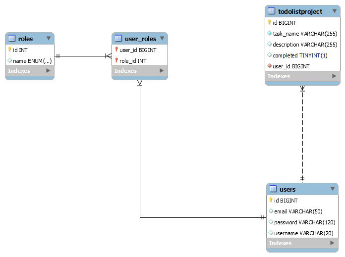

# Todolist Application

Welcome to my first to-do list application built with Java Springboot.

## Overview 
This application provides basic CRUD operations for managing tasks in a to-do list. Users can create, read, update, and delete tasks through RESTful API endpoints.


## Features

- Create a new task
- Read all tasks
- Update an existing task
- Delete all tasks

## Project Setup 
Clone the repository to your local machine.
Open the project in IntelliJ IDEA.
Ensure your MySQL server is running and configured correctly.
Run the application from IntelliJ.
Open Postman and start interacting with your API endpoints.

# Tech used 
- Java
- Spring Boot
- Spring Data JPA
- Spring Web
- MySQL Workbench
- Postman
- MySQL Connector
- React 


## API Endpoints

- `GET /api/todolists`: Retrieve all tasks.
- `POST /api/todolists`: Create a new task.
- `PUT /api/todolists`: Update an existing task.
- `DELETE /api/todolists`: Delete all tasks.
- `POST /api/todolists/addTask`: Add the necessary task and description params.

## Viewing and Managing 

You can view and manage your tasks through MySQL Workbench or by accessing the application URL:

- Backend Results: Access via MySQL Workbench or http://localhost:8080
- Frontend Interface: Visit http://localhost:3000/ to input tasks and descriptions


## Feedback 
Feel free to provide any suggestions or feedback for improvement. Thank you !

## New Updates:
- In my new TodolistRestController `POST /api/todolists/addTask`: 
this simply makes it easier for myself to create new entries for 
my todolist backend application.So instead of hardcoding all the entries 
needed to process: id, task, description and completed for my POST, 
I only need to type in the params needed which is ,Task and Description.


- In my client folder, I used React to create a small front end server to communicate/create a fetch request between 
my backend, still in progress.
- Added CorsConfig class in my backend project to make it happen. 
- For now, with the addition of my frontend server/react app 'http://localhost:3000/',
this url allows the user to input things in my to-do-list and my backend will 
retrieve the information that was entered.
- More functionalities will be implemented soon ! 


## 2.0:
- Added a few more API endpoints in my TodolistRestController 
- Added some new front-end user interface features. 
- More functionalities will be implemented soon like security, maybe task priority, 
status who knows ?

### NEW API Endpoints 
- `GET /api/todolists/{taskId} ` : Gets task by ID
- `DELETE /api/todolists/{taskId} ` : Deletes task by ID 
- `PUT /api/todolists/{taskId}/markComplete` : Helps the front-end  mark as complete
and relays new information to the backend. 


### React/Front End 
- As of now, I added buttons `Delete All Tasks `, `Mark as Complete` and `Delete Task` :
- So whenever a user goes on http://localhost:3000/ enters a task or description, 
automatically the front-end accepts the task and description as `not completed/false` 
- The user has two options for each task they can `Mark as Complete` or `Delete Task` without having
to complete it. 
- Once completed, the boolean flips `Yes/True` and changes 
immediately reflects in the backend.
- `Delete All Tasks` simply clears every record in the Todolist. 


## 2.5:
### Welcome Back ! 

- Came back with some new changes:
- Implemented Token-based Authentication with JWT and Spring Security.
- Added Models for users along with three roles: User, Moderator & Admin 
for creating user-like privileges.

## New Features

- Create a new task according to logged-in User
- Read all tasks according to logged-in User
- Sign-in 
- Sign-up 

## New Tech
- JWT AUTH
- Spring Security

### EER Diagram Expansion:
- To ensure every user can access their own todolist/database, I had to create
a 1 to M relationship between todolistproject and users.
- So modified Todolistproject and User Entities to support this by creating a new field
user_id and labeled it as a foreign key to reference the user's table ID.


### New classes:
- Added a Repository & Service Class for Todolistproject. The Repository was made 
to reduce boilerplate code.

## NEW/Modified API Endpoints 
`TodolistRestController`
- `GET /api/todolists/` : `Modified *` This Endpoint retrieves all tasks associated
with logged-in user in contrast to before retrieving everything. 
- `POST /api/todolists/`: `Modified *` This Endpoint allows for creating a task 
associated with logged-in user. 
  - If the associated user isn't logged in and tries to access this endpoint,
  it will create an exception. 


`AuthController`
- `POST /api/auth/signin` : Authenticate user by username and password, 
returns a JWT token.
  -  #### Request Body:
  ```json 
  {
    "username": "user_name",
    "password": "password"
  }
  ```
  
  -  #### Return Body: 
  In response, the user receives an authentication token, which they can use to access protected resources 
  by including it in the Authorization header of later requests.
  ```json 
  {
    "id": 1,
    "username": "username",
    "email": "username@bezkoder.com",
    "roles": [
        "ROLE_USER"
    ],
    "tokenType": "Bearer",
    "accessToken": "XXX"
  }
  ```
- `POST /api/auth/signup` : Creates a user by username and password,  
  - #### Request Body:
  ```json
   {
   "username": "kyle_singler",
   "email": "kyle.singler@bezkoder.com",
   "password": "slime123",
   "role": ["user"]
  }
  ```
  -  #### Return Body:
  ```json
  {
  "message": "User registered successfully!"
  }
  ```

## New Updates:
I still some have more endpoints to correct will shortly be up and running, Front-End/
React is currently down.
Next steps are planning to:
- Work on the Front-End, Ensuring a User-friendly login
- More-Endpoints for the TodolistRestController to provide more functionalities
- Maybe look into deployment, 
maybe heroku for the backend or netlify for the front-end.


## Feedback
More features are coming soon.
Please feel free to 
provide any suggestions or feedback for improvement.
Thank you!

  

  


